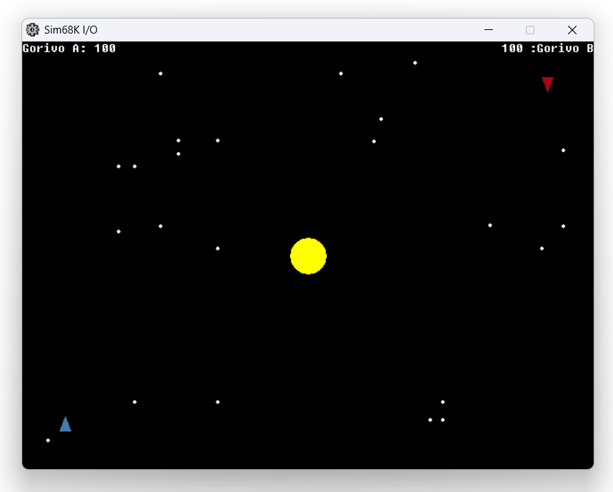

# Galaxy Game (MC68k)

- Kolegij: [Građa računala](https://web.math.pmf.unizg.hr/nastava/gr)
- Mentor: [dr. sc. Sebastijan Horvat](https://web.math.pmf.unizg.hr/~sehorva/)
- Izradio: [Alexander Gustovarac](https://alexandergustovarac.from.hr/)
- Obrazovna ustanova: [Sveučilište u Zagrebu, Prirodoslovno-matematički fakultet (UNIZG, PMF)](https://www.pmf.unizg.hr)
- Akademska godina: 2025 / 2026

## Zadatak

Potrebno je napraviti pojednostavljenu verziju igre _Galaxy Game_ za MC68000.
Igru _Galaxy Game_ napravili su Bill Pitts i Hugh Tuck 1971. godine. Igra se igrala na konzoli sastavljenoj od računala PDP-11 (tvrtke Digital Equipment Corporation), monitora i igraće palice Smatra se jednom od prvih komercijalnih konzola na kovanice - igrači su morali platiti 10 (američkih) centi po igri ili su mogli odabrati tri igre za 25 centi. Igra _Galaxy Game_ temelji se na ranijoj igri Spacewar! (iz 1962. godine). Prikaz igre _Galaxy Game_ možete vidjeti ovdje: [YouTube](https://youtu.be/50kGmIaOGuQ).

Cijeli projekt se nalazi na [OVOME (PDF)](./projekt.pdf) linku.

## O [EASy68k](http://easy68k.com)

[EASy68K](http://easy68k.com) is a 68000 Structured Assembly Language IDE. [EASy68K](http://easy68k.com) allows you to edit, assemble and run 68000 programs on a Windows PC or Wine. No additional hardware is required. [EASy68K](http://easy68k.com) is an open source project distributed under the GNU general public use license.

## Upravljanje

| Tipka            | Opis                              |
|------------------|-----------------------------------|
| <kbd>A</kbd>     | Rotacija broda A u lijevo         |
| <kbd>D</kbd>     | Rotacija broda A u desno          |
| <kbd>S</kbd>     | Ispucivanje projektila iz broda A |
| <kbd>W</kbd>     | Pomicanje broda A unaprijed       |
| <kbd>Left</kbd>  | Rotacija broda B u lijevo         |
| <kbd>Right</kbd> | Rotacija broda B u desno          |
| <kbd>Down</kbd>  | Ispucivanje projektila iz broda B |
| <kbd>Up</kbd>    | Pomicanje broda B unaprijed       |
| <kbd>Space</kbd> | Pokretanje igre                   |
| <kbd>E</kbd>     | Zaustavljanje igre                |

## Rješenje

Slika rješenja:

Kod za igru se nalazi u [.X68](./galaxy_game.X68) datoteci
